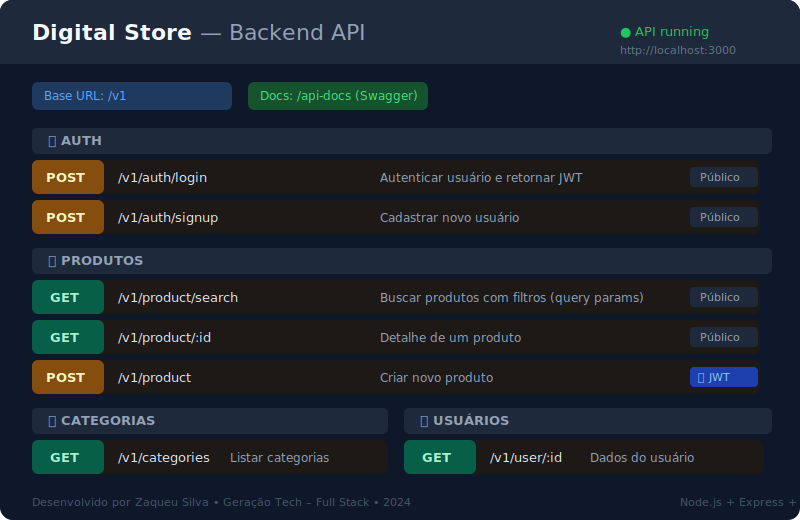

# Digital Store — Backend

> **Desenvolvedor:** Zaqueu Silva — Formação Full Stack · Geração Tech

API REST do projeto **Digital Store**, desenvolvido como atividade final do curso de **Formação em Desenvolvedor Full Stack – Projeto Geração Tech**.

---

## Preview da API



> Documentação interativa completa disponível em **`http://localhost:3000/api-docs`** (Swagger UI) após subir o servidor.

---

## Começando rápido (3 passos)

1. Crie o banco no MySQL e confirme que o schema existe:
   sql
   CREATE DATABASE digital_store CHARACTER SET utf8mb4 COLLATE utf8mb4_unicode_ci;
   
2. Crie o arquivo `.env` em `backend/` (veja a seção [Configuração de Ambiente](#configuração-de-ambiente) abaixo).

3. Rode no terminal:
   npm install
   npm run dev
   

A API sobe em `http://localhost:3000` e a documentação Swagger em `http://localhost:3000/api-docs`.

---

## Sobre

Este backend fornece todos os dados e autenticação para o frontend [digital-store-frontend](https://github.com/ZSSOUSA/digital-store-frontend).

---

## Tecnologias Utilizadas

| Tecnologia | Uso |
|---|---|
| Node.js | Runtime JavaScript |
| Express | Framework HTTP |
| Sequelize | ORM para banco de dados |
| MySQL (mysql2) | Banco de dados relacional |
| JWT (jsonwebtoken) | Autenticação via token |
| bcrypt | Hash de senhas |
| cors | Controle de acesso entre origens |
| dotenv | Variáveis de ambiente |
| nodemon | Reload automático em desenvolvimento |

---

## Endpoints Principais

Base URL: `http://localhost:3000/v1`

| Método | Endpoint | Descrição | Auth |
|--------|----------|-----------|------|
| POST | `/v1/auth/login` | Login do usuário (retorna JWT) | Não |
| POST | `/v1/auth/signup` | Cadastro de usuário | Não |
| GET | `/v1/products` | Listar produtos | Não |
| GET | `/v1/products/:id` | Detalhe de produto | Não |
| GET | `/v1/categories` | Listar categorias | Não |
| GET | `/v1/users/me` | Dados do usuário autenticado | Sim |

Endpoints protegidos exigem header: `Authorization: Bearer <token>`

---

## Estrutura do Projeto
```
src/
├── app.js           # Middlewares e registro de rotas
├── server.js        # Inicialização do servidor e conexão com o banco
├── config/
│   └── database.js  # Configuração do Sequelize
├── controllers/     # Recebem req/res e chamam services
├── services/        # Regras de negócio e acesso aos models
├── models/          # Models Sequelize + associações
├── routes/          # Rotas HTTP (prefixo /v1)
├── middleware/
│   └── authMiddleware.js  # Verificação de JWT
└── images/          # Imagens estáticas servidas em /images
```


## Pré-requisitos

- Node.js (v16+)
- npm
- MySQL rodando (local ou remoto)

## Configuração de Ambiente

Crie um arquivo `.env` na pasta `backend/`:

.env
DB_HOST=localhost
DB_NAME=digital_store
DB_USER=root
DB_PASS=sua_senha

JWT_SECRET=sua_chave_secreta

# Opcionais
PORT=3000
CORS_ORIGIN=http://localhost:3001

## Setup do Banco (MySQL)

O schema precisa existir antes de subir a API (as tabelas são criadas automaticamente via `sequelize.sync()`):

sql
CREATE DATABASE digital_store CHARACTER SET utf8mb4 COLLATE utf8mb4_unicode_ci;


## Como Executar

```bash
cd backend
npm install

# Desenvolvimento (nodemon)
npm run dev

# Produção
npm start
```

A API sobe em `http://localhost:3000`.


## Autor

- **Desenvolvedor:** Zaqueu Silva
- **GitHub:** (https://github.com/ZSSOUSA)


## Licença

MIT
